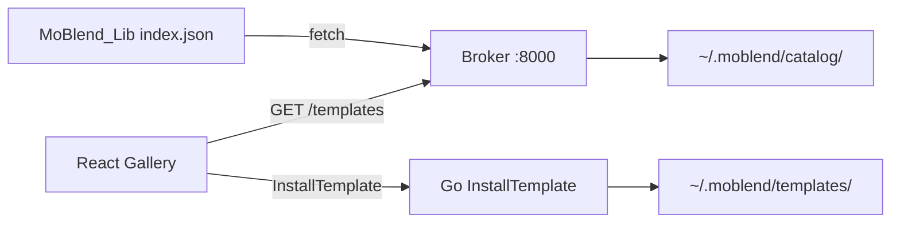

# M4 — Registry Integration

**Status:** Planned (sliced into **M4a → M4b → M4c → M4d**)  
**Roadmap:** [ROADMAP.md § M4](../ROADMAP.md#m4--registry-integration)  
**Placement:** After M3a Local Persistence, before M5 OBS Panel

## 1. Objective

Connect Mo.Blend Studio to the official template library: fetch a cached `index.json` catalog through the broker, install `.mo.blend` binaries via the Go backend into `~/.moblend/templates/`, and browse/install/open templates from the Home gallery.

**Library repo (sibling):** [`MoBlend_Lib`](../../MoBlend_Lib) — GitOps source for `lib.moblend.dev` during beta. PRD 7 describes the long-term `moblend-registry` naming; this repo is the v1 implementation.

**Monorepo implements client integration only** — no registry CI in `MoBlend_Studio`.

---

## 2. Architecture (do not violate)

| Concern | Owner | Notes |
|---------|-------|-------|
| Catalog metadata | **Broker** `GET /api/v1/templates` | Single authoritative listing for Wails, OBS, MCP |
| Catalog fetch/cache | **Broker Python** | Fetches `index.json`; body on disk at `<moblend_home>/catalog/index.json`; metadata in `broker.db` `catalog_cache` |
| Binary install | **Go** `InstallTemplate` | Streams `download_url` → `~/.moblend/templates/`; never parses `.mo.blend` |
| Install map | **`studio.db`** `installed_templates` | Cache only — files on disk are authoritative |
| Gallery UI | **React** | Broker for catalog; Go for install; broker for `POST /project/load` |
| Registry URL | **`config.json`** | Human-editable `registryBaseUrl` |



---

## 3. Slice sequence

Run **in order** — each slice has its own spec and `/implement-m4*` skill.

| Slice | Spec | Repo | Unblocks |
|-------|------|------|----------|
| **M4a** | [M4a — Library Repository Bootstrap](M4a%20-%20Library%20Repository%20Bootstrap.md) | `MoBlend_Lib` (+ schema in `MoBlend_Studio/specs/`) | Real `index.json` + at least one publishable template |
| **M4b** | [M4b — Broker Catalog Cache](M4b%20-%20Broker%20Catalog%20Cache.md) | `MoBlend_Studio/engine/` | `GET /api/v1/templates`, OBS/Sentinel catalog reads |
| **M4c** | [M4c — Go Template Install](M4c%20-%20Go%20Template%20Install.md) | `MoBlend_Studio/desktop/` | Binary cache + `studio.db` install map |
| **M4d** | [M4d — Gallery UI and Suite Manager](M4d%20-%20Gallery%20UI%20and%20Suite%20Manager.md) | `MoBlend_Studio/desktop/frontend/` | ROADMAP M4 done-when |

**Progress tokens:** `M004` for parent milestone; sub-slices use `M004a`, `M004b`, etc. (e.g. `.progress/M004a.001.library-bootstrap.md`).

---

## 4. M4 done-when (full milestone)

From [ROADMAP.md](../ROADMAP.md):

- Suite Manager shows catalog status; broker serves live catalog from configured `registryBaseUrl`
- Home gallery shows previews; Install streams `.mo.blend` via Go to local cache
- Installed template loads through existing M3 editor flow (viewport, params, slots)

**Out of scope:** Registry CI in `MoBlend_Lib` (GitHub Actions can be M4a follow-up), Stitch search/filter chips (optional M4d stretch), MCP tool wiring (cheap follow-up once M4b lands).

---

## 5. Config keys (`config.json`)

| Key | Type | Default (dev) | Owner |
|-----|------|---------------|-------|
| `registryBaseUrl` | string (URL) | `https://raw.githubusercontent.com/ndx-video/MoBlend_Lib/main` | Suite — set in M4b |
| `catalogRefreshHours` | number | `24` | Broker TTL — set in M4b |
| `catalogFixturePath` | string (path, optional) | unset | Dev override: read local `index.json` instead of HTTP |

---

## 6. `<moblend_home>` additions (M4)

```
<moblend_home>/
├── catalog/
│   └── index.json          # broker cache body (authoritative on disk for offline)
└── templates/              # installed .mo.blend binaries (Go writes)
```

`broker.db` `catalog_cache` holds `fetched_at`, `etag`, `source_url`, `body_hash` only — not the JSON body (per M3a §2).

---

## 7. Contracts

| Artifact | Schema |
|----------|--------|
| Per-template manifest | [manifest.schema.json](manifest.schema.json) |
| Library catalog | [catalog.schema.json](catalog.schema.json) |
| REST listing shape | [Mo.Blend API & Function Spec §2](Mo.Blend%20API%20&%20Function%20Spec.md) — `GET /api/v1/templates` returns the `templates` array flattened |

---

## 8. Dev workflow

1. Complete **M4a** in `MoBlend_Lib` — push so raw Git URL serves `index.json`.
2. **M4b** — point `registryBaseUrl` at raw Git or local `catalogFixturePath` for offline dev.
3. **M4c** — install a template; verify file under `~/.moblend/templates/`.
4. **M4d** — gallery E2E with mocked broker + Go bindings.

Sibling path from monorepo root: `../MoBlend_Lib`.