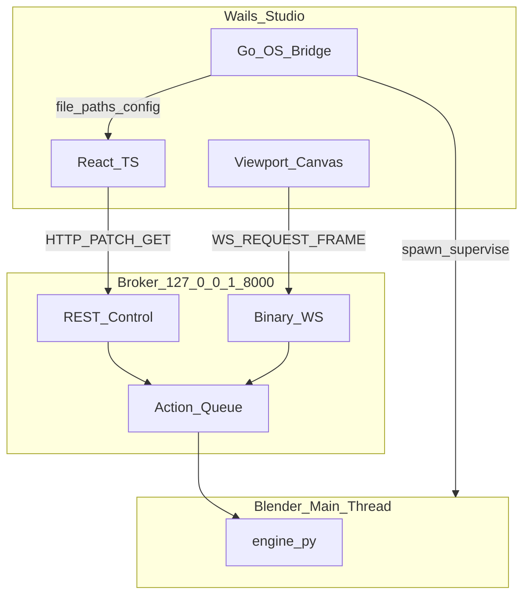

# **PRD 4: Studio (Wails Desktop UI)**

## **1\. Objective**

To provide a blazing-fast, lightweight desktop application called **Mo.Blend Studio**, tailored for casual motion designers and marketers. The UI must completely hide the underlying Blender engine, presenting a highly constrained, Canva/CapCut-style interface driven entirely by pre-configured .mo.blend templates. Additionally, it serves as the centralized hub for managing the entire Mo.Blend software ecosystem.

## **2\. Core Architecture**

The desktop application will be built using **Wails v2**, combining a Go-based backend with a modern web frontend (React + TypeScript recommended).

* **The Go Backend:** Acts as a lightweight window manager, local filesystem bridge, and system process orchestrator. It handles drag-and-drop file operations, manages local configuration files, spawns/supervises the headless Blender+engine process tree, and streams template binaries from the registry CDN.  
* **The Web Frontend:** Implements the UI components and maintains a direct HTTP/WebSocket connection to the Mo.Blend API Server (PRD 3) running locally at localhost:8000.  
* **Zero Blender Coupling (Rendering & Data):** The desktop app must *never* attempt to read or parse .mo.blend files directly, mutate bpy state, or render frames locally. All template loading, parameter mutation, and viewport rendering must go through the API Broker at localhost:8000.  
* **Process Orchestration (Allowed):** The Go backend *may* spawn and supervise `blender --background --python ...` as the engine process tree (Suite Manager health checks, startup, and shutdown watchdog). This is lifecycle management, not direct rendering.

### **2.1 Target Platforms**

| Platform | Priority | Shell |
|----------|----------|-------|
| Windows (x64) | **Primary** | Wails + WebView2 — all v1 development and release builds target Windows first |
| Linux (x64) | Secondary | Wails + WebKitGTK — parity after Windows MVP |
| macOS (Apple Silicon) | Secondary | Wails + WebKit — arm64 builds when Windows MVP is stable |

The React frontend connects to `ws://127.0.0.1:8000` for viewport frames on all platforms. Go handles OS-specific process signals for the Blender watchdog (e.g. Windows job objects / Unix SIGTERM).

## **3\. Monorepo Integration**

Mo.Blend Studio lives in the `MoBlend_Studio` monorepo alongside the Python engine and web clients:

```
MoBlend_Studio/
├── engine/          # Python: bootstrap, moblend engine, FastAPI broker (PRD 1–3)
├── desktop/         # Wails app: Go backend + frontend/ (PRD 4)
├── clients/
│   ├── obs/         # PRD 5 — static HTML/JS for OBS CEF dock
│   └── sentinel/    # PRD 6 — placeholder; placement TBD
├── specs/
├── scripts/         # dev: start-engine, build-desktop
└── ROADMAP.md
```

Suite Manager paths resolve relative to the monorepo install during development, or from bundled resources in release builds.

## **4\. Mo.Blend Studio Suite Manager (The Hub)**

To remove guesswork and streamline user onboarding, Mo.Blend Studio includes a dedicated "Suite Manager" panel in the settings. This acts as a unified package manager for the entire ecosystem.

* **Component Tracking:** Visually tracks the installation status, version numbers, and local paths of all suite components:  
  * Official Blender Distribution (validates path and version compatibility).  
  * Mo.Blend Python Engine (PRD 2).  
  * API Broker / MCP Server (PRD 3).  
  * Official Template Library (`lib.moblend.dev`, PRD 7).  
* **Automated Setup:** Provides one-click installation or updating of the Python Engine and API Broker components from the monorepo (dev) or bundled release artifacts.  
* **Health Checks:** Runs diagnostic checks to ensure the headless Blender instance can be successfully launched and the API port (8000) is available.  
* **Component Explanations:** Includes clear, concise tooltips and documentation within the UI explaining what each component does, demystifying the architecture for casual users.

## **5\. UI/UX Paradigm: The "No Nodes" Policy**

To prevent UI complexity creep, the application enforces a strict parameter-only interface for project editing.

* Users cannot see, add, or wire nodes.  
* Users cannot see traditional animation keyframes or dope sheets.  
* The entire interface is dynamically generated based on the GET /manifest response from the loaded template.

## **6\. Key Application Components**

### **6.1 The Live Viewport (Data Plane)**

* **Technology:** An HTML5 \<canvas\> element (potentially hardware-accelerated via WebGL).  
* **Data Flow:** The React frontend opens a **binary WebSocket** directly to `ws://127.0.0.1:8000/api/v1/viewport/stream` (not through Go bindings—Wails base64-encodes bound byte arrays).  
* **Rendering:** Receives raw JPEG/WebP byte arrays per PRD 3 wire format and paints them to the canvas at 30/60fps via `createImageBitmap` or equivalent.  
* **Interaction:** Includes basic playback controls (Play, Pause, Scrub) which send REQUEST_FRAME binary messages back over the WebSocket.

### **6.2 Dynamic Parameter Grid (Control Plane)**

* **Generation:** When a project is loaded, the UI parses the JSON manifest and auto-generates the inspector panel.  
* **Component Mapping:** The manifest `type` values are the canonical set defined in [`manifest.schema.json`](manifest.schema.json); the inspector maps each to a control:  
  * "type": "string" \-\> single-line Text Input; "type": "text" \-\> multi-line Text Area.  
  * "type": "color\_rgba" \-\> Color Picker.  
  * "type": "float" / "int" with "min"/"max" \-\> Slider; without bounds \-\> numeric input.  
  * "type": "bool" \-\> Toggle/Checkbox.  
  * "type": "enum", "options": \["Neon", "Flat"\] \-\> Dropdown.  
  * "type": "image" / "video" / "font" \-\> Asset picker (drag-drop + file dialog) routed through the §6.4 sandbox ingestion flow.  
* **Throttling:** Fast-changing UI elements (like dragging a slider) must be debounced/throttled before sending PATCH /parameters requests to prevent flooding the Blender Action Queue.

### **6.3 Slot-Based Timeline**

* **Concept:** A horizontal, block-based timeline track.  
* **Behavior:** Users drag edges of "Slots" to change their duration (e.g., making the "Intro" block last 3 seconds instead of 2).  
* **Translation:** The UI translates these UI blocks into absolute start/end timestamps and sends them via the API to the Python Engine, which calculates the required geometry node math under the hood.

### **6.4 Asset Manager & Local Ingestion**

* **Drag-and-Drop:** Users can drop .png, .mp4, or .ttf files directly into the Wails window.  
* **Processing Flow:** 1\. Go backend (`OnFileDrop`) intercepts the file and copies it to a secure local sandbox (e.g., \~/.moblend/assets/), hashing the file to prevent duplicates.  
  2\. Go generates a local file:// URI.  
  3\. The UI sends a PATCH /parameters request with the local URI to the API Broker.  
  4\. The Broker ingests the file into the active Blender session's memory.

## **7\. System Configuration & Security**

* **Config Files:** Advanced configuration (pointing the UI to a remote Mo.Blend cluster instead of localhost, or setting memory limits) is handled via the single canonical suite config file `<moblend_home>/config.json` — Windows `%USERPROFILE%\.moblend\config.json` (primary), Linux/macOS `~/.moblend/config.json`. This is the same file the engine and broker read (see PRD 1 §5 and PRD 3 §2.2). Edit it with any platform-appropriate text editor (Notepad/VS Code on Windows; `vi`/`nano` on Linux/macOS).  
* **Process Watchdog:** If the Mo.Blend Studio app closes unexpectedly, the Go backend must send a kill signal to the local Mo.Blend headless process to prevent orphaned Blender instances from consuming system RAM in the background. Go `os/exec` and signal handling are responsible for monitoring this lifecycle.  
* **Template Library Fetch:** When a user installs a template from the official library (`lib.moblend.dev` / PRD 7 registry), the Go backend streams the .mo.blend binary via `http.Get` to `~/.moblend/templates/`.

---

## **8\. Platform Readiness Matrix (M0–M2)**

This section records what exists **as of M2** (broker commit `1856deb`) versus what PRD 4 §6–§7 requires. Use it before starting M3 work; update only when a milestone closes a gap. Full API shapes live in [Mo.Blend API & Function Spec.md](Mo.Blend%20API%20&%20Function%20Spec.md); milestone gates in [ROADMAP.md](../ROADMAP.md).

| PRD 4 component | Broker endpoint | Engine function | Status | Milestone |
|-----------------|-----------------|-----------------|--------|-----------|
| **§6.1 Live viewport** | `WS /api/v1/viewport/stream` | `render_frame` | **ready** | M2 |
| **§6.2 Parameter grid** | `GET /manifest`, `PATCH /parameters` | `set_parameter`, manifest sync | **ready** | M1–M2 |
| **§6.2 Asset params** (image/video/font) | *(ingest route TBD)* | `ingest_asset` | **missing** | M3 engine + broker |
| **§6.3 Slot timeline** | `PATCH /api/v1/slots` | `set_slot` | **missing** | M3 engine + broker |
| **§6.4 Asset sandbox copy** | — (Go only) | — | **missing** | M3 Go |
| **§4 Suite Manager health** | `GET /api/v1/health` | — | **ready** (poll only) | M2 |
| **§4 Engine spawn/supervise** | — | `bootstrap.py --serve` | **missing** in Go | M3 Go |
| **§4 Broker deps (FastAPI)** | — | `engine/vendor` via dev.ps1 | **ready** (dev script) | M2 dev; M3 Go |
| **§7 Config file** | — | — | **missing** in Go/UI | M3 |
| **§7 Process watchdog** | — | — | **missing** | M3 Go |
| **Template gallery** | `GET /api/v1/templates` | `list_templates` | **stub** (`[]`) | M4 |
| **Export / publish** | `POST /render/export`, `GET /render/status/{id}` | export job queue | **missing** | M3 (202 + poll MVP) |
| **Project load/save** | `POST /project/load`, `POST /project/save` | `load_template`, `save_project` | **ready** | M1–M2 |
| **Wails shell** | — | — | **stub** (greet template) | M3 |

**Legend:** **ready** = implemented and verified in M1/M2 tests; **stub** = endpoint or UI exists but returns placeholder; **missing** = not in codebase yet.

### **8.1 ROADMAP M3 “done when” traceability**

| M3 gate | UI binding | Blocker (if any) |
|---------|------------|------------------|
| Go spawns/supervises engine on start; kills on exit | Suite Manager + app lifecycle | Go `StartEngine` / `StopEngine` (§12) |
| Local `.mo.blend` → viewport → param edits | Home/Projects + Editor | Broker ready; Go file picker + `POST /load` |
| Timeline slots update | Editor bottom track | `PATCH /slots` + `engine.set_slot` |
| Drag-drop asset → sandbox → ingest | Assets + Editor asset params | Go drop handler + ingest API |
| Export job (202 + poll) | Export screen | `POST /render/export` + status poll |

---

## **9\. Milestone Phasing (Iterative Delivery)**

Mo.Blend Studio is built iteratively. Stitch exports under [`specs/stitch/`](stitch/) are **design references**, not runnable code. Each screen maps to a React route; M3 delivers the MVP slice; later milestones flesh out gallery, registry, and export encoding.

| Stitch folder | Route | M3 deliverable | Deferred |
|---------------|-------|----------------|----------|
| [`screen_suite-manager`](stitch/screen_suite-manager/) | `/settings/suite` | Go spawn/kill broker, health poll, Blender path, `engine/vendor` deps status | Auto-update from CDN |
| [`screen_edit`](stitch/screen_edit/) | `/editor` | WS viewport canvas, manifest param grid, slot timeline *(when §8 slots API exists)* | — |
| [`screen_home`](stitch/screen_home/) | `/` | “Open local `.mo.blend`” + empty-state; gallery cards disabled or placeholder | M4: `GET /templates`, install flow |
| [`screen_projects`](stitch/screen_projects/) | `/projects` | Recent paths from Go local store | Cloud sync |
| [`screen_assets`](stitch/screen_assets/) | `/assets` | List sandbox files via Go; wire ingest when API exists | Registry assets |
| [`screen_export`](stitch/screen_export/) | `/export` | UI shell; disabled or 501 message until export API | Full encode pipeline |
| [`screen_user-settings`](stitch/screen_user-settings/) | `/settings` | Read/write `~/.moblend/config.json` via Go | Remote cluster UI |

**Note:** The original [Stitch prompt](stitch-prompt.txt) specified four screens (Home/Gallery, Editor, Export, Suite Manager). The repo contains **seven** exports—Projects, Assets, and User Settings were added during design. All seven are first-class routes; do not fold them into modals without updating this table.

Screen index for agents: [`specs/stitch/README.md`](stitch/README.md).

---

## **10\. Frontend Architecture (React)**

Prescriptive layout for `desktop/frontend/src/` (create incrementally during M3):

```
desktop/frontend/src/
  app/              # router, providers, broker URL context
  layout/           # AppShell: nav rail (shared across screens)
  theme/            # tokens.css from specs/stitch/*/DESIGN.md
  broker/           # REST client, WS viewport hook, error envelope parsing
  features/
    editor/         # screen_edit — viewport, param grid, timeline
    suite/          # screen_suite-manager
    gallery/        # screen_home (M4 grows here)
    projects/       # screen_projects
    assets/         # screen_assets
    export/         # screen_export
    settings/       # screen_user-settings
  wails/            # thin typed wrapper around Go bindings
```

### **10.1 Responsibility split**

| Concern | Owner | Examples |
|---------|-------|----------|
| Render, manifest, parameters, slots, export jobs | **React → Broker** (HTTP/WS direct) | `PATCH /parameters`, WS `REQUEST_FRAME` |
| OS paths, spawn/kill Blender, file dialogs, drag-drop copy, CDN download, config I/O | **React → Go** (Wails bindings) | `PickMoBlendFile`, `StartEngine`, `OnFileDrop` |
| bpy, `.mo.blend` parse, EEVEE render | **Broker → Engine** (never desktop) | — |

### **10.2 Control-plane rules**

* Debounce `PATCH /parameters` **150–300 ms**; coalesce slider drags into one batch where possible.
* On scrub/playback, send WebSocket `REQUEST_FRAME` with **`FLAG_DROP_STALE` (0x01)** so the broker skips superseded frames (see PRD 3 §3.2).
* Do not paint frames client-side if a newer scrub request was already sent (mirror server stale-drop).
* Read broker base URL from Go (`GetBrokerBaseURL()`), default `http://127.0.0.1:8000` — do not hardcode for production or remote-cluster configs (§7).

### **10.3 Viewport performance expectations**

PRD 6.1 targets 30/60 fps interactively. M2 headless verification measured **~12–14 fps** steady-state at 256×144 on Windows dev hardware (see `.progress/M002.002.m2-committed.md`). Studio MVP should:

* Use moderate preview resolution (scale down in REQUEST_FRAME width/height).
* Warm up EEVEE with a few frames before showing fps-sensitive UI.
* Treat high fps as a **goal**, not a CI gate, until GPU/path optimizations land.

### **10.4 Reference implementation**

Port wire-format and REST patterns from [`engine/tests/m2_viewport_tester.html`](../engine/tests/m2_viewport_tester.html) (13-byte LE REQUEST, FRAME decode, `createImageBitmap`, debounced PATCH). Automated gate: [`engine/tests/m2_broker_client.py`](../engine/tests/m2_broker_client.py).

### **10.5 Window and layout**

Stitch designs assume **≥1280px** width. Raise Wails default window size (currently 1024×768 in `desktop/main.go`) to at least **1280×800** for MVP, or implement collapsible sidebars per Stitch `DESIGN.md` breakpoints.

---

## **11\. Stitch → React Integration Guide (AI Agents)**

Follow this workflow when implementing or extending Studio UI. **Do not** paste `code.html` into the Wails app.

### **11.1 Per-screen workflow**

1. **Read** `specs/stitch/<screen>/DESIGN.md` for tokens (YAML frontmatter + prose). Tokens are duplicated across screens—extract once (step 2).
2. **Use** `specs/stitch/<screen>/screen.png` for visual QA; compare implemented React against the screenshot.
3. **Do not copy** `code.html` verbatim—it uses Tailwind CDN, Google Fonts CDN, Material Symbols CDN, static placeholder data, and `href="#"` navigation.
4. **Map** screen → route → `features/<name>/` per §9.
5. **Compose** with shared `AppShell` (left nav rail from `screen_home` / `screen_edit`) + screen-specific panels.
6. **Replace** static text/lists with live data: manifest-driven controls (§6.2), `GET /health` for Suite Manager cards, Go bindings for paths/recents.
7. **Mark gaps** in code: `// STUB(M4): gallery from GET /templates` or `// BLOCKED: PATCH /api/v1/slots` where backend is missing—never call bpy or parse `.mo.blend` from TypeScript/Go to work around missing APIs.
8. **Verify** against a running broker: `scripts/dev.ps1` or Go-spawned serve → health → load → manifest → WS frame.

### **11.2 Design tokens**

* Canonical source: YAML block at top of any `specs/stitch/*/DESIGN.md` (colors, typography, spacing, rounded).
* Implement once as `desktop/frontend/src/theme/tokens.css` (CSS custom properties).
* Prose in DESIGN.md may cite hex values (e.g. `#16171B`) that differ slightly from token keys (`surface-container-low`); prefer **token keys** in code.
* **Icons:** Stitch HTML uses Material Symbols; [stitch-prompt.txt](stitch-prompt.txt) originally asked for Lucide-style line icons. **M3 recommendation:** Lucide React in production (tree-shaking); treat Stitch icons as layout reference only.

### **11.3 Forbidden patterns**

| Do not | Why |
|--------|-----|
| Embed Stitch `code.html` or Tailwind CDN in production | Offline Wails build, no CDN dependency |
| Stream viewport frames through Go Wails bindings | Base64 overhead; violates AGENTS.md |
| Parse or mutate `.mo.blend` in Go or TypeScript | Sandbox rule; broker owns bpy |
| Add MCP tools to desktop MVP | M6 / broker scope |
| Invent REST endpoints not in API spec | Breaks OBS/Sentinel parity |
| Call `blender` or Python from the frontend | Use Go spawn + broker only |

### **11.4 Shared navigation**

All seven Stitch screens share the same left nav rail (Home, Projects, Assets, Suite Manager, Settings). Implement **`AppShell`** once in `layout/`; routes swap the main content region only.

---

## **12\. Go Backend Surface (Wails Bindings)**

Minimum Go API the React frontend calls. Exact names may vary in implementation; semantics must match.

| Binding | Purpose |
|---------|---------|
| `GetBrokerBaseURL() string` | e.g. `http://127.0.0.1:8000`; future override from `config.json` |
| `GetConfig() / SetConfig(partial)` | Read/write `~/.moblend/config.json` |
| `PickMoBlendFile() string` | Native `.mo.blend` open dialog; returns absolute path |
| `GetRecentProjects() / AddRecentProject(path)` | Local recents list (Projects screen) |
| `StartEngine(loadPath string) error` | Spawn `blender --background --factory-startup --python <bootstrap> -- --serve [--load path]` |
| `StopEngine()` | Terminate supervised Blender/broker process tree |
| `EngineHealth() (HealthDTO, error)` | HTTP GET `/api/v1/health` proxy or pass-through URL for frontend |
| `OnFileDrop(files)` | Wails file drop → copy to `%USERPROFILE%\.moblend\assets\` (hash dedupe) → return absolute paths |
| `InstallTemplate(url string) error` | **(M4)** Stream `.mo.blend` to `~/.moblend/templates/` |

### **12.1 Process lifecycle (mirror dev.ps1)**

On **`StartEngine`**, Go should replicate what [`scripts/dev.ps1`](../scripts/dev.ps1) does today:

1. Resolve Blender executable (Windows: `C:\Program Files\Blender Foundation\Blender *\blender.exe`, then PATH).
2. Ensure broker deps: `pip install --target engine/vendor fastapi uvicorn[standard]` using Blender’s bundled Python (see dev.ps1 § [3/5]).
3. Launch: `blender --background --factory-startup --python engine/bootstrap.py -- --serve [--load <path>]`.
4. Poll `GET /api/v1/health` until success or timeout (~45s).
5. On app exit or `StopEngine`, kill the process group (Windows job object / Unix SIGTERM) to avoid orphaned Blender instances (§7).

During **development**, engineers may still run `scripts/dev.ps1` without Wails; Studio must not depend on a manually opened broker window long-term.

### **12.2 Asset path handoff**

PRD §6.4 step 3 sends a local URI to the broker. Until `ingest_asset` is implemented, document the intended contract: absolute filesystem path (or `file://` URL) in `PATCH /parameters` for `image`/`video`/`font` params—the broker copies into `%TEMP%\moblend_assets\` and loads into bpy. Do not assume this works in M2; gate UI on API availability.

---

## **13\. Risks, Mitigations, and Future Iterations**

### **13.1 Predicted integration risks**

| Priority | Risk | Mitigation |
|----------|------|------------|
| Critical | Slot timeline has no backend | Implement `engine.set_slot` + `PATCH /slots` before wiring Editor timeline; UI shows read-only manifest `slots` until then |
| Critical | Export API missing | M3: 501 stubs + Export screen disabled state; then 202 + poll MVP |
| Critical | Asset ingest chain incomplete | Go sandbox first; broker ingest second; disable asset param pickers until both exist |
| Critical | No Go process orchestration | Suite Manager + `StartEngine`/`StopEngine` are M3 blockers |
| High | Viewport fps below 30 in headless dev | Lower preview resolution; debounce; stale-drop flag; set user expectations |
| High | Gallery UI before M4 registry | Local “Open file” only; stub gallery with `GET /templates` → `[]` |
| High | Broker URL hardcoded | Always via Go/config |
| High | Missing FastAPI in Blender Python | Surface in Suite Manager; auto pip to `engine/vendor` |
| Medium | Stitch not drop-in React | Follow §11; single token file + AppShell |
| Medium | 1024×768 window vs 1280px designs | Bump min window or collapsible sidebars |
| Medium | WebKit vs WebView2 WS quirks | Test Wails dev + build early; same protocol as m2_viewport_tester |

### **13.2 Engine/broker work that unblocks UI**

These may land in **M3 engine sub-phases** before Wails UI catches up:

* `engine.set_slot` + `PATCH /api/v1/slots`
* `engine.ingest_asset` + REST ingest (or documented PATCH path for asset params)
* `POST /api/v1/render/export` + `GET /api/v1/render/status/{id}` (job skeleton)
* Manifest test templates with `slots`, asset params, and slot_presets for integration tests

### **13.3 Future iterations (post-M3)**

* **M4:** Gallery from `lib.moblend.dev`, `InstallTemplate`, live `GET /templates`.
* **M5:** Export presets overlap OBS transparent WebM path—share broker export where possible.
* **M6:** Sentinel may reuse React viewport/param components; packaging TBD (standalone vs Wails route).
* **Cross-platform:** Linux/macOS Go spawn and signal handling after Windows MVP stable.
* **Slot math** lives in template geometry nodes (PRD 2)—Studio only sends seconds/preset_id; never expose node graphs (§5).

### **13.4 Architecture diagram (data vs control plane)**



